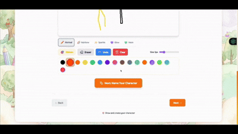
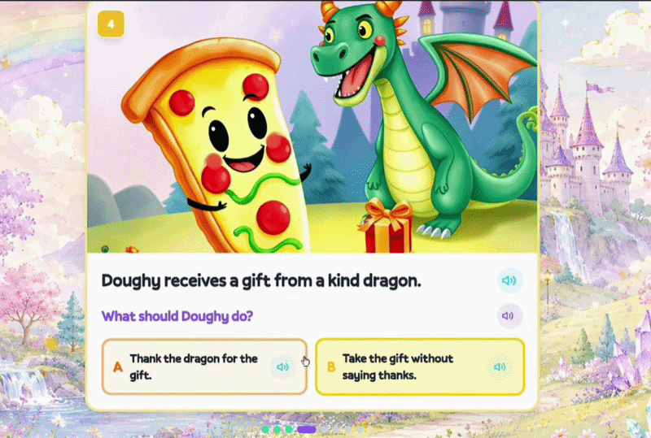

<p align="center">
  
</p>

<h1 align="center">Fablecraft</h1>

<p align="center">
  <strong>Turn your child's drawings into AI-powered interactive story adventures that teach real life lessons.</strong>
</p>

<p align="center">
  <a href="http://54.88.159.186:3000">🔗 Live Demo</a> •
  <a href="https://youtu.be/Ue89uc2zHyU">🎬 Video</a> •
  <a href="https://devpost.com/software/fablecraft">📋 Devpost</a>
</p>

---

## The Problem

Kids spend 3+ hours daily on screens — but almost none of it is creative. They watch, scroll, and tap — but rarely **create**. Every parent feels this tension.

**Fablecraft asks:** What if a 5-year-old's drawing session could become a personalized AI storybook that teaches them about sharing, honesty, or being brave?

---

## How It Works

<p align="center">
  
  <br/>
  <em>A child's drawing transformed into an AI-animated character</em>
</p>

| Step | What Happens | AI Behind It |
|------|-------------|--------------|
| 🖌️ **Draw** | Child draws on canvas or uploads a photo | — |
| ✨ **Generate** | AI creates an animated character | Vision AI + Image Generation |
| 📖 **Learn** | Pick a life lesson (sharing, kindness, courage...) | Content Moderation |
| 🌍 **Explore** | Choose a world: Fantasy, Space, Underwater, Jungle | — |
| 🎮 **Play** | 8-scene interactive quest with choices | LLM Story Generation |
| 🔊 **Listen** | AI narrates every scene aloud | Neural Text-to-Speech |

---

## Content Safety — Built for Kids

Fablecraft blocks inappropriate content automatically. If a child draws something unsuitable, the AI catches it and responds with a gentle, child-friendly message.

<p align="center">
  
  <br/>
  <em>Content moderation in action — keeping the experience safe and friendly</em>
</p>

---

## System Architecture

```
┌─────────────────────────────────────────────────────────────────┐
│                      FABLECRAFT ARCHITECTURE                     │
├─────────────────────────────────────────────────────────────────┤
│                                                                  │
│  ┌────────────────┐          ┌────────────────────────────────┐ │
│  │   Frontend     │  REST    │       Backend (FastAPI)         │ │
│  │   Next.js 14   │ ──────►  │                                │ │
│  │   React 18     │          │  ┌───────────┐  ┌───────────┐ │ │
│  │   TypeScript   │          │  │  Vision   │  │   Quest   │ │ │
│  │   Tailwind CSS │          │  │ Analyzer  │  │  Engine   │ │ │
│  └────────────────┘          │  └─────┬─────┘  └─────┬─────┘ │ │
│         │                    │        │               │       │ │
│  ┌──────▼───────┐           │  ┌─────▼─────┐  ┌─────▼─────┐ │ │
│  │ Gamification │           │  │ Character │  │   Scene   │ │ │
│  │ • XP/Levels  │           │  │ Generator │  │Illustrator│ │ │
│  │ • Streaks    │           │  └─────┬─────┘  └─────┬─────┘ │ │
│  │ • Achieve.   │           │        │               │       │ │
│  └──────────────┘           │  ┌─────▼───────────────▼─────┐ │ │
│                              │  │       AI Services          │ │ │
│  ┌──────────────┐           │  │  • Amazon Bedrock (Claude) │ │ │
│  │    Audio     │           │  │  • Gemini (Image Gen)      │ │ │
│  │ • Music/SFX  │           │  │  • ClipDrop (Stability)    │ │ │
│  │ • TTS Duck   │           │  │  • Amazon Polly (TTS)      │ │ │
│  └──────────────┘           │  └─────────────┬─────────────┘ │ │
│                              │                │               │ │
│                              │  ┌─────────────▼─────────────┐ │ │
│                              │  │       Amazon S3            │ │ │
│                              │  │    (Asset Storage)         │ │ │
│                              │  └───────────────────────────┘ │ │
│                              └────────────────────────────────┘ │
│                                                                  │
│  ┌──────────────────────────────────────────────────────────┐   │
│  │                  Novus.ai (Analytics)                      │   │
│  │   Auto-instrumented • 8 Product Areas • 2 Personas        │   │
│  │   5 Key Flows • Session Replay • Zero manual tagging      │   │
│  └──────────────────────────────────────────────────────────┘   │
└─────────────────────────────────────────────────────────────────┘
```

### Component Breakdown

| Component | Technology | Purpose |
|-----------|-----------|---------|
| **Frontend** | Next.js 14, React 18, TypeScript, Tailwind CSS | Drawing canvas, story UI, gamification |
| **Backend** | FastAPI, Python, Pydantic | AI orchestration, content safety, API |
| **AI (Text)** | Amazon Bedrock (Claude, Nova Pro/Lite) | Vision analysis, story generation, moderation |
| **AI (Images)** | Gemini 2.5 Flash, ClipDrop (Stability AI) | Character & scene illustration |
| **AI (Voice)** | Amazon Polly (Neural/Generative) | Text-to-speech narration |
| **Storage** | Amazon S3 | All generated assets |
| **Analytics** | Novus.ai (Pendo) | Auto-instrumented user behavior |
| **Hosting** | AWS EC2 | Production deployment |

---

## Features

### For Children (ages 4-8)

- 🎨 **Drawing Canvas** — Magic brushes (rainbow, sparkle, glow, neon), stickers, undo
- 🤖 **AI Character Generation** — Every scribble becomes a real animated character
- 📖 **Interactive Quests** — 8 scenes with questions, choices, and life lessons
- 🔊 **Read-Aloud Narration** — AI reads the story so pre-readers can play independently
- ⭐ **Stars & Rewards** — Earn coins for correct answers
- 🏆 **Achievements** — 10 unlockable badges ("First Masterpiece", "World Traveler", "Perfect Score")
- 🔥 **Daily Streaks** — Encourages regular creative play
- 🗺️ **Adventure Map** — Visual progress across 4 story worlds
- 📚 **Bookshelf** — History of all completed stories
- 🎵 **Genre Music** — Background tracks change per story world

### For Parents

- 🔒 **PIN-Protected Dashboard** — See progress without child access
- 📊 **Progress Tracking** — Quests completed, lessons learned, time spent
- 🛡️ **Content Safety** — AI blocks violence, weapons, inappropriate content
- 👫 **Collaborative Mode** — Two kids play through a shared story

---

## Novus.ai Integration

<p align="center">
  
  <br/>
  <em>Novus auto-instrumented our product — zero manual tagging required</em>
</p>

Novus connected to our GitHub repository and auto-detected:
- **8 Product Areas** — Home, Character Creation, Quest Setup, Story Adventure, Gallery, Collaborative Play, Parent Dashboard, Progress & Rewards
- **2 User Personas** — Child (Primary User), Parent (Oversight User)
- **5 Key Flows** — End-to-end user journeys
- **5 Integrations** — Amazon Bedrock, Polly, S3, CloudFront, Novus

---

## Getting Started (Local Development)

### Prerequisites
- Node.js 18+
- Python 3.11+
- AWS credentials (Bedrock, S3, Polly access)

### Frontend

```bash
cd frontend
npm install
npm run dev
```

### Backend

```bash
cd agents_service
pip install -r requirements.txt
cp .env.example .env  # Add your API keys
uvicorn main:app --reload --port 8080
```

### Environment Variables

See `agents_service/.env.example` for all required configuration:
- `AWS_REGION` — AWS region for Bedrock/S3/Polly
- `S3_BUCKET_NAME` — S3 bucket for asset storage
- `GEMINI_API_KEY` — Google Gemini for image generation
- `CLIPDROP_API_KEY` — ClipDrop/Stability AI for character images
- `OPENROUTER_API_KEY` — Fallback LLM provider

---

## Production Deployment

### Docker (Backend)

```bash
cd agents_service
docker build -t fablecraft-backend .
docker run -d -p 8080:8080 --env-file .env --name backend fablecraft-backend
```

### Next.js Standalone (Frontend)

```bash
cd frontend
NEXT_PUBLIC_API_URL=http://your-backend:8080 npm run build
cp -r public .next/standalone/public
cp -r .next/static .next/standalone/.next/static
PORT=3000 node .next/standalone/server.js
```

---

## Quest Preview

<p align="center">
  
  <br/>
  <em>Interactive 8-scene quest with AI-generated illustrations</em>
</p>

---

## Tech Stack

```
Frontend:    Next.js 14 • React 18 • TypeScript • Tailwind CSS
Backend:     FastAPI • Python • Pydantic
AI (Text):   Amazon Bedrock (Claude, Nova Pro/Lite)
AI (Images): Gemini 2.5 Flash • ClipDrop (Stability AI)
AI (Voice):  Amazon Polly (Neural/Generative)
Storage:     Amazon S3
Analytics:   Novus.ai (auto-instrumented)
Hosting:     AWS EC2
```

---

## What's Next

- 🎨 Character customization with AI suggestions
- 📄 Story export as printable PDF
- 🎬 Animated scenes via video AI
- 📊 Difficulty levels (Easy/Medium/Advanced)
- 🎃 Seasonal content (Halloween, holidays)

---

## License

MIT

---

<p align="center">
  Built with ❤️ for World Product Day 2026<br/>
  <a href="http://54.88.159.186:3000">Try Fablecraft</a> •
  <a href="https://youtu.be/Ue89uc2zHyU">Watch Demo</a> •
  <a href="https://www.novus.ai">Powered by Novus.ai</a>
</p>
